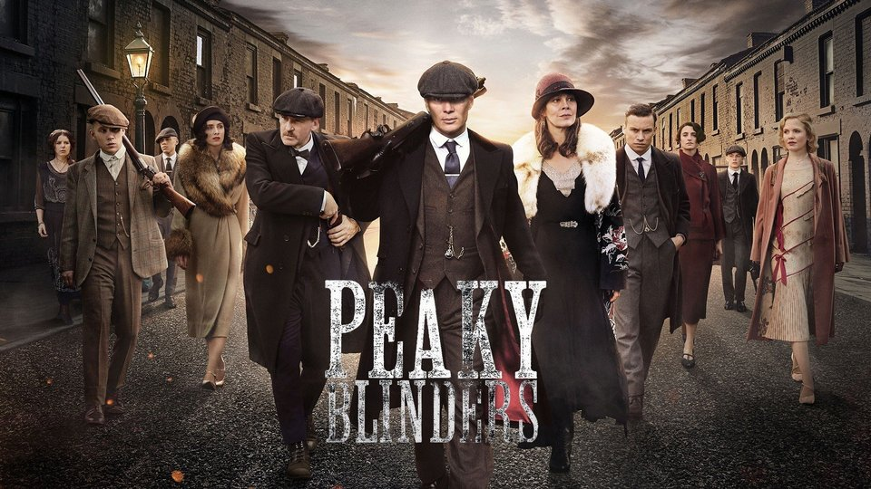

# Odev-2
Kişisel Sayfamızı Detaylandırmaya Devam Etmek
<!DOCTYPE html>
<html lang="tr">
<head>
    <meta charset="UTF-8">
    <meta http-equiv="X-UA-Compatible" content="IE=edge">
    <meta name="viewport" content="width=device-width, initial-scale=1.0">
    <title>Document</title>
</head>
<body style="font-family:verdana;" style="font-size:300%;">
    <!-- Başlık -->
    <h1> Semanur Işıktaş </h1>
    <!-- Alt başlık -->
    <h2 style="color: #C21010"> Hakkımda </h2>
        
 Merhaba, ben Semanur Işıktaş. 20 yaşındayım ve <strong>İstanbul</strong>'da yaşıyorum. <strong>Marmara Üniversitesi Bilgisayar Programcılığı</strong> 2. sınıf öğrencisiyim. Yazılım ve web geliştirme ile ilgileniyorum. Hedefim yazılım alanında kendimi geliştirmek ve iyi bir düzeye gelmek. Kodluyoruz'un bu eğitim serisi sayesinde harika şeyler öğrendim ve öğrenmeye devam ediyorum. 

    <h2 style="color:#C21010"> İlgi Alanlarım </h2>
    <ol>
        <li> Film 
            <ul>
                <a href="https://www.imdb.com/title/tt0816692/" target="_blank">
                    <li> Interstellar </li>
                </a>
                <a href="https://www.imdb.com/title/tt0470752/?ref_=nv_sr_srsg_0" target="_blank">
                    <li> Ex Machina </li>
                </a>
            </ul>
        </li>
        <li> Dizi
            <ul>
                <li> Peaky Blinders </li>
                <li> You </li>
            </ul> 
        </li>
        <li> Kitap 
            <ul>
                <a href="https://www.goodreads.com/book/show/61439040-1984?from_search=true&from_srp=true&qid=EsVLQyb4GQ&rank=1" target="_blank">
                    <li> 1984 (George Orwell) </li>
                </a>
                <li> Kürk Mantolu Madonna (Sabahattin Ali) </li>
                <li> Fareler ve İnsanlar (John Steinbeck) </li>
                <li> Sineklerin Tanrısı (William Golding) </li>
            </ul>
        </li>
    </ol>

        <h2 style="color: #C21010"> Sevdiğim Diziler </h2>
            <h3> Peaky Blinders </h3>
            
            
 1919 yılında İngiltere, Birmingham'daki bir suç çetesinin başında ne pahasına olursa    olsun yükselmeyi kafasına koymuş, acımasız mafya babası Tommy Shelby vardır.  
            Başroldekiler: Cillian Murphy, Sam Neill, Helen McCrory  
            Yaratıcılar: Steven Knight 

            <h3> You </h3>
            
            
 Tehlikeli bir cazibeye sahip, ileri derecede obsesif genç bir adam, takıntı hâline getirdiği kişilerin yaşamlarına girmek için sınırları zorlar.  
            Başroldekiler: Penn Badgley, Victoria Pedretti, Elizabeth Lail  
            Yaratıcılar: Greg Berlanti, Sera Gamble 

</body>
</html>
